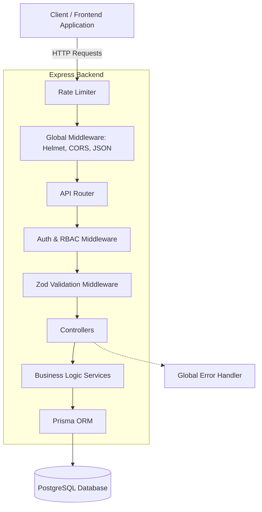

# Architecture Overview

This document outlines the architectural design, folder structure, and design patterns used in the Finance Dashboard API. The system is built using **Node.js, Express, TypeScript, and Prisma**, prioritizing scalability, maintainability, and security.

---

## 1. High-Level System Architecture

The application follows a standard Client-Server architecture with a robust middleware pipeline for security and data validation.



---

## 2. Feature-Based Folder Structure

Rather than grouping files by type (e.g., all controllers together, all routes together), this project uses a **Feature-Based Architecture**. This means everything related to a specific domain lives in its own folder.

This approach makes the codebase highly scalable and easier to navigate as the project grows.

```text
src/
├── config/              # Global configuration (DB, Env vars)
├── middleware/          # Reusable middleware (Auth, Validation, Error Handling)
├── features/            # Feature modules (Domain-Driven)
│   ├── auth/            # Authentication & Registration logic
│   ├── users/           # User management (Admin only)
│   ├── transactions/    # Income/Expense CRUD & filtering
│   └── dashboard/       # Aggregated metrics and analytics
└── __tests__/           # Integration and unit tests
```

### Inside a Feature Folder
Every feature strictly follows the **Controller-Service pattern**:
* **`routes.ts`**: Defines the HTTP endpoints and attaches middleware (Auth, Role, Validation).
* **`controllers.ts`**: Handles the HTTP request/response cycle. It extracts data from the request and passes it to the service.
* **`services.ts`**: Contains all business logic and database interactions via Prisma. Keeps the controller clean.
* **`schemas.ts`**: Zod validation schemas to ensure incoming data is strictly typed and safe.

---

## 3. Security & Request Pipeline

Every request passes through a strict security pipeline before hitting the database:

1. **Helmet & CORS:** Sets secure HTTP headers and restricts cross-origin resource sharing.
2. **Rate Limiting:** Prevents brute-force attacks and DDoS by limiting requests per IP window.
3. **Authentication (`authenticateJWT`):** Verifies the JWT signature and checks the database to ensure the user is not deactivated (Soft Delete check).
4. **Authorization (`roleGuard`):** Verifies if the authenticated user has the necessary privileges (`VIEWER`, `ANALYST`, or `ADMIN`) for the specific route.
5. **Validation (`validateMiddleware`):** Uses Zod to ensure the request body, parameters, and queries perfectly match the expected types.

---

## 4. Database Design (Prisma)

The database schema is managed via Prisma ORM, utilizing a relational structure. 

### Core Entities
* **User**: Manages authentication credentials, roles, and account status (`isActive` for soft deletes).
* **Transaction**: Stores financial records, linked directly to the User who created it via a foreign key relation. 

*Note: For the exact schema structure, please refer to `prisma/schema.prisma` in the project root.*
