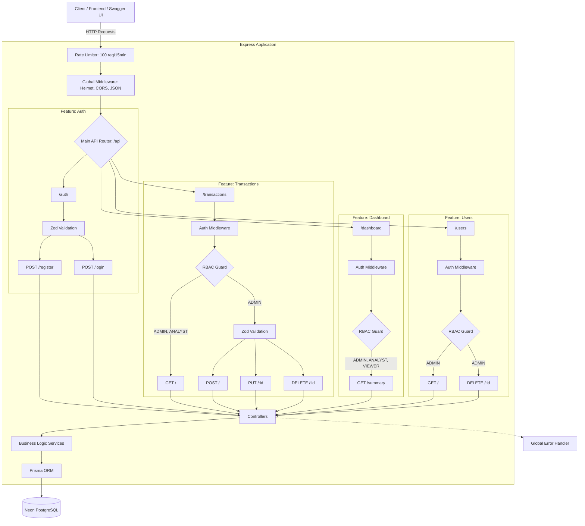

# Architecture Overview

This document outlines the architectural design, folder structure, and design patterns used in the
Finance Dashboard API. The system is built using **Node.js, Express, TypeScript, and Prisma**,
prioritizing scalability, maintainability, and security.

---

## 1. High-Level System Architecture

The application follows a standard Client-Server architecture with a robust middleware pipeline for
security and data validation.



---

## 2. Feature-Based Folder Structure

Rather than grouping files by type (e.g., all controllers together, all routes together), this
project uses a **Feature-Based Architecture**. This means everything related to a specific domain
lives in its own folder.

This approach makes the codebase highly scalable and easier to navigate as the project grows.

```text
src/
├── app.ts                 # Express application and middleware setup
├── server.ts              # Server entry point and initialization
├── config/                # Global configuration (DB connections, Env vars)
├── features/              # Feature modules (Domain-Driven)
│   ├── __tests__/         # Integration and unit tests
│   ├── auth/              # Authentication & Registration logic
│   ├── dashboard/         # Aggregated metrics and analytics
│   ├── transactions/      # Income/Expense CRUD & filtering
│   └── users/             # User management (Admin only)
├── generated/             # Auto-generated files
├── middleware/            # Reusable middleware (Auth, Validation, Error Handling)
├── models/                # Global data models or interfaces
├── services/              # Shared or cross-domain business logic
├── types/                 # Custom TypeScript type definitions (e.g., express.d.ts)
└── utils/                 # Shared utility and helper functions
```

### Inside a Feature Folder

Every feature strictly follows the **Controller-Service pattern**:

- **`routes.ts`**: Defines the HTTP endpoints and attaches middleware (Auth, Role, Validation).
- **`controllers.ts`**: Handles the HTTP request/response cycle. It extracts data from the request
  and passes it to the service.
- **`services.ts`**: Contains all business logic and database interactions via Prisma. Keeps the
  controller clean.
- **`schemas.ts`**: Zod validation schemas to ensure incoming data is strictly typed and safe.

---

## 3. Security & Request Pipeline

Every request passes through a strict security pipeline before hitting the database:

1. **Helmet & CORS:** Sets secure HTTP headers and restricts cross-origin resource sharing.
2. **Rate Limiting:** Prevents brute-force attacks and DDoS by limiting requests per IP window.
3. **Authentication (`authenticateJWT`):** Verifies the JWT signature and checks the database to
   ensure the user is not deactivated (Soft Delete check).
4. **Authorization (`roleGuard`):** Verifies if the authenticated user has the necessary privileges
   (`VIEWER`, `ANALYST`, or `ADMIN`) for the specific route.
5. **Validation (`validateMiddleware`):** Uses Zod to ensure the request body, parameters, and
   queries perfectly match the expected types.

---

## 4. Database Design (Prisma)

The database schema is managed via Prisma ORM, utilizing a relational structure.

### Core Entities

- **User**: Manages authentication credentials, roles, and account status (`isActive` for soft
  deletes).
- **Transaction**: Stores financial records, linked directly to the User who created it via a
  foreign key relation.

_Note: For the exact schema structure, please refer to `prisma/schema.prisma` in the project root._
